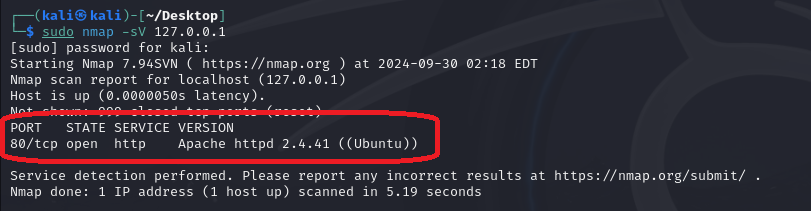
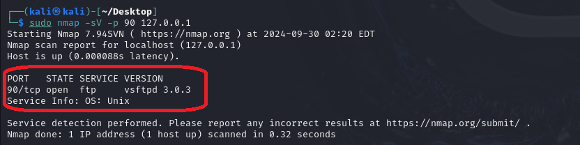

# PortSpoof


```bash
         _                                  _                        
        | |                                | |                       
   ___  | |__     __ _   _ __ ___     ___  | |   ___    ___    _ __  
  / __| | '_ \   / _` | | '_ ` _ \   / _ \ | |  / _ \  / _ \  | '_ \ 
 | (__  | | | | | (_| | | | | | | | |  __/ | | |  __/ | (_) | | | | |
  \___| |_| |_|  \__,_| |_| |_| |_|  \___| |_|  \___|  \___/  |_| |_|
                                                                     
Configuring...
Enter the port number: 80
Choose a service to simulate:
1. HTTP
2. FTP
3. SMTP
4. SSH
Enter the number of the service you want to simulate: 1
HTTP is now running on port 80...
Connection from ('127.0.0.1', 37416) established.
Connection from ('127.0.0.1', 37418) established.
Connection from ('127.0.0.1', 37432) established.
Connection from ('127.0.0.1', 37434) established.
Connection from ('127.0.0.1', 50788) established.
```

<p align="center">
    
</p>

```bash
         _                                  _                        
        | |                                | |                       
   ___  | |__     __ _   _ __ ___     ___  | |   ___    ___    _ __  
  / __| | '_ \   / _` | | '_ ` _ \   / _ \ | |  / _ \  / _ \  | '_ \ 
 | (__  | | | | | (_| | | | | | | | |  __/ | | |  __/ | (_) | | | | |
  \___| |_| |_|  \__,_| |_| |_| |_|  \___| |_|  \___|  \___/  |_| |_|
                                                                     
Configuring...
Enter the port number: 90
Choose a service to simulate:
1. HTTP
2. FTP
3. SMTP
4. SSH
Enter the number of the service you want to simulate: 2
FTP is now running on port 90...
Connection from ('127.0.0.1', 57336) established.
```

<p align="center">
    
</p>

```bash
         _                                  _                        
        | |                                | |                       
   ___  | |__     __ _   _ __ ___     ___  | |   ___    ___    _ __  
  / __| | '_ \   / _` | | '_ ` _ \   / _ \ | |  / _ \  / _ \  | '_ \ 
 | (__  | | | | | (_| | | | | | | | |  __/ | | |  __/ | (_) | | | | |
  \___| |_| |_|  \__,_| |_| |_| |_|  \___| |_|  \___|  \___/  |_| |_|
                                                                     
Configuring...
Enter the port number: 80
Choose a service to simulate:
1. HTTP
2. FTP
3. SMTP
4. SSH
Enter the number of the service you want to simulate: 3
Killed process with PID: 2363 on port: 80
Forcefully killed process with PID: 2363 on port: 80
Waiting for port 80 to be free...
SMTP is now running on port 80...
Connection from ('127.0.0.1', 33152) established.
Connection from ('127.0.0.1', 33164) established.
Connection from ('127.0.0.1', 33170) established.
Connection from ('127.0.0.1', 33190) established.
Connection from ('127.0.0.1', 33176) established.
Connection from ('127.0.0.1', 33200) established.
Connection from ('127.0.0.1', 58066) established.
```

<p align="center">
    
</p>

```bash
         _                                  _                        
        | |                                | |                       
   ___  | |__     __ _   _ __ ___     ___  | |   ___    ___    _ __  
  / __| | '_ \   / _` | | '_ ` _ \   / _ \ | |  / _ \  / _ \  | '_ \ 
 | (__  | | | | | (_| | | | | | | | |  __/ | | |  __/ | (_) | | | | |
  \___| |_| |_|  \__,_| |_| |_| |_|  \___| |_|  \___|  \___/  |_| |_|
                                                                     
Configuring...
Enter the port number: 90
Choose a service to simulate:
1. HTTP
2. FTP
3. SMTP
4. SSH
Enter the number of the service you want to simulate: 4
Killed process with PID: 3070 on port: 90
Forcefully killed process with PID: 3070 on port: 90
Waiting for port 90 to be free...
SSH is now running on port 90...
Connection from ('127.0.0.1', 50228) established.
```
