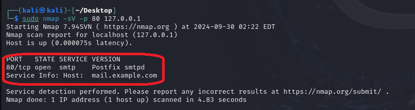
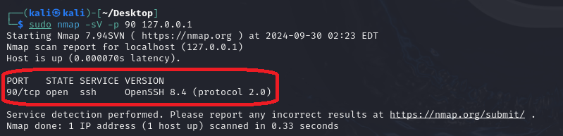

# Chameleon

**Chameleon** is a simple port spoofing tool written in Python that allows you to simulate various services on common ports (HTTP, FTP, SMTP, and SSH) by sending fake banners. This can be useful for testing and educational purposes, especially in network security scenarios.

## Features
- **Port Check & Process Kill:** Automatically checks if the specified port is in use, and kills any process running on that port.
- **Service Simulation:** Simulates a variety of common services, including HTTP, FTP, SMTP, and SSH, and responds with fake banners.
- **User Input:** Takes user input to select the service to simulate and the port number to listen on.
- **Connection Handling:** Accepts incoming connections, sends the relevant banner, and then closes the connection.
- **Easy to Use:** Simple CLI interface for selecting service and port.

## Services
The script can simulate the following services:
- **HTTP** - Responds with an HTTP/1.1 200 OK message.
- **FTP** - Sends a 220 FTP welcome message.
- **SMTP** - Sends a 220 ESMTP banner.
- **SSH** - Sends an SSH-2.0 OpenSSH banner.

## Usage
### Requirements
- Python 3.x
- `lsof` (required for killing processes on Linux systems)

## Installation
- Clone the repository:

```bash
git clone https://github.com/RadeelAhmad/Chameleon.git
cd Chameleon
```

- Run the script:

```bash
python3 Code.py
```

## Running the Script
- Enter the port number on which you want to run the fake service.
- Select the service you want to simulate by entering the corresponding number.
- The script will kill any existing process running on the chosen port and start simulating the service.

## Example

## HTTP
```bash
         _                                  _                        
        | |                                | |                       
   ___  | |__     __ _   _ __ ___     ___  | |   ___    ___    _ __  
  / __| | '_ \   / _` | | '_ ` _ \   / _ \ | |  / _ \  / _ \  | '_ \ 
 | (__  | | | | | (_| | | | | | | | |  __/ | | |  __/ | (_) | | | | |
  \___| |_| |_|  \__,_| |_| |_| |_|  \___| |_|  \___|  \___/  |_| |_|
                                                                     
Configuring...
Enter the port number: 80
Choose a service to simulate:
1. HTTP
2. FTP
3. SMTP
4. SSH
Enter the number of the service you want to simulate: 1
HTTP is now running on port 80...
Connection from ('127.0.0.1', 37416) established.
Connection from ('127.0.0.1', 37418) established.
Connection from ('127.0.0.1', 37432) established.
Connection from ('127.0.0.1', 37434) established.
Connection from ('127.0.0.1', 50788) established.
```

<p align="center">
    
</p>

```bash
         _                                  _                        
        | |                                | |                       
   ___  | |__     __ _   _ __ ___     ___  | |   ___    ___    _ __  
  / __| | '_ \   / _` | | '_ ` _ \   / _ \ | |  / _ \  / _ \  | '_ \ 
 | (__  | | | | | (_| | | | | | | | |  __/ | | |  __/ | (_) | | | | |
  \___| |_| |_|  \__,_| |_| |_| |_|  \___| |_|  \___|  \___/  |_| |_|
                                                                     
Configuring...
Enter the port number: 90
Choose a service to simulate:
1. HTTP
2. FTP
3. SMTP
4. SSH
Enter the number of the service you want to simulate: 2
FTP is now running on port 90...
Connection from ('127.0.0.1', 57336) established.
```

<p align="center">
    
</p>

```bash
         _                                  _                        
        | |                                | |                       
   ___  | |__     __ _   _ __ ___     ___  | |   ___    ___    _ __  
  / __| | '_ \   / _` | | '_ ` _ \   / _ \ | |  / _ \  / _ \  | '_ \ 
 | (__  | | | | | (_| | | | | | | | |  __/ | | |  __/ | (_) | | | | |
  \___| |_| |_|  \__,_| |_| |_| |_|  \___| |_|  \___|  \___/  |_| |_|
                                                                     
Configuring...
Enter the port number: 80
Choose a service to simulate:
1. HTTP
2. FTP
3. SMTP
4. SSH
Enter the number of the service you want to simulate: 3
Killed process with PID: 2363 on port: 80
Forcefully killed process with PID: 2363 on port: 80
Waiting for port 80 to be free...
SMTP is now running on port 80...
Connection from ('127.0.0.1', 33152) established.
Connection from ('127.0.0.1', 33164) established.
Connection from ('127.0.0.1', 33170) established.
Connection from ('127.0.0.1', 33190) established.
Connection from ('127.0.0.1', 33176) established.
Connection from ('127.0.0.1', 33200) established.
Connection from ('127.0.0.1', 58066) established.
```

<p align="center">
    
</p>

```bash
         _                                  _                        
        | |                                | |                       
   ___  | |__     __ _   _ __ ___     ___  | |   ___    ___    _ __  
  / __| | '_ \   / _` | | '_ ` _ \   / _ \ | |  / _ \  / _ \  | '_ \ 
 | (__  | | | | | (_| | | | | | | | |  __/ | | |  __/ | (_) | | | | |
  \___| |_| |_|  \__,_| |_| |_| |_|  \___| |_|  \___|  \___/  |_| |_|
                                                                     
Configuring...
Enter the port number: 90
Choose a service to simulate:
1. HTTP
2. FTP
3. SMTP
4. SSH
Enter the number of the service you want to simulate: 4
Killed process with PID: 3070 on port: 90
Forcefully killed process with PID: 3070 on port: 90
Waiting for port 90 to be free...
SSH is now running on port 90...
Connection from ('127.0.0.1', 50228) established.
```

<p align="center">
    
</p>

## Notes
- **Port Permission:** If you plan to use a port below 1024, ensure you run the script as a superuser (using `sudo`).
- **Process Killing:** The script will attempt to terminate any process occupying the specified port before starting the service. Use with caution on production machines.
